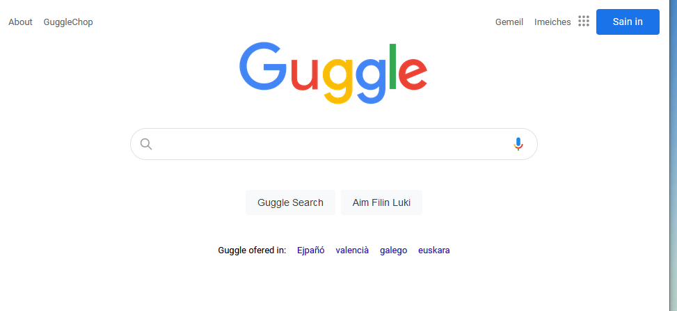

# React 2 - Exercise

Fake Google clone with React Components

https://classroom.google.com/u/0/c/NDgwNDYwMTI2OTAz/a/NTMzNTI2NTc2MzI0/details

### Components structure
* App
    * Header
        * TextButton left
        * TextButton left
        * TextButton right
        * TextButton right
    * Home
        * SearchBlock
        * GreyButton
        * GreyButton
        * TextButton (lang)
        * TextButton (lang)
        * TextButton (lang)
        * TextButton (lang)

### Screenshot

### Author

Xavimat [@xavi-mat](@xavi-mat) [LinkedIn](https://www.linkedin.com/in/xavier-matoses/)